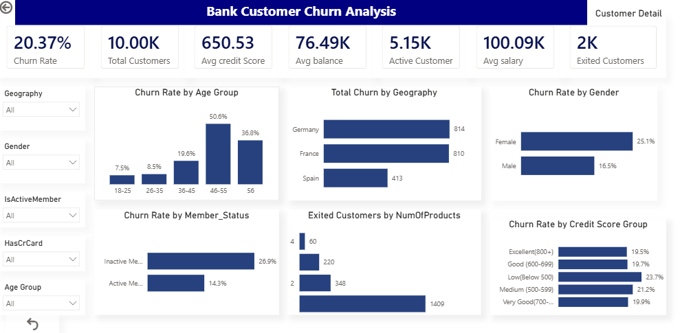
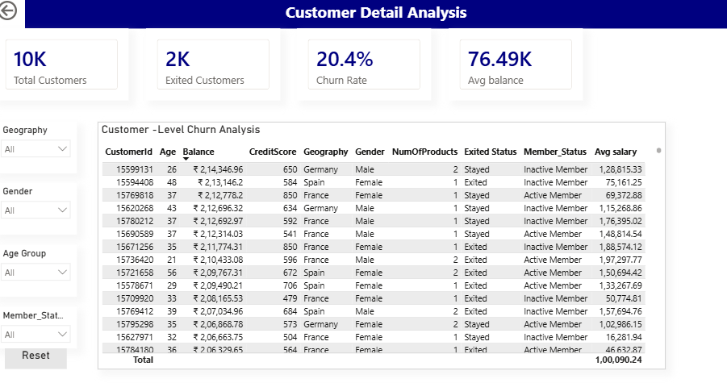

# Bank Customer Churn Analysis – Power BI

## About the Project

This project is a Power BI dashboard created to understand customer churn in a banking dataset.

The dashboard looks at customer details such as age, gender, geography, credit score, number of products and member status to see which groups have higher churn.

## Tools Used

- Power BI
- Power Query
- DAX
- Excel

## What the Dashboard Shows

- Total Customers
- Exited Customers
- Churn Rate
- Average Credit Score
- Average Balance
- Active Customers
- Average Salary
- Churn by Age Group
- Churn by Geography
- Churn by Gender
- Churn by Member Status
- Exited Customers by Number of Products
- Churn by Credit Score Group

## Customer Details

The second page shows customer-level information such as:

- Customer ID
- Age
- Geography
- Gender
- Credit Score
- Balance
- Number of Products
- Member Status
- Exit Status

There are also filters for Geography, Gender, Age Group and Member Status.

## Key Findings

- Churn is higher in some age groups than others.
- Inactive members have a higher churn rate than active members.
- Churn varies between different countries.
- Churn also changes based on the number of products a customer has.
- Credit score groups show different churn rates.

## Dashboard Preview

### Churn Analysis Dashboard

### Customer Detail

## Project File

The Power BI file used for this project is available in this repository.

## Author

Ritu
